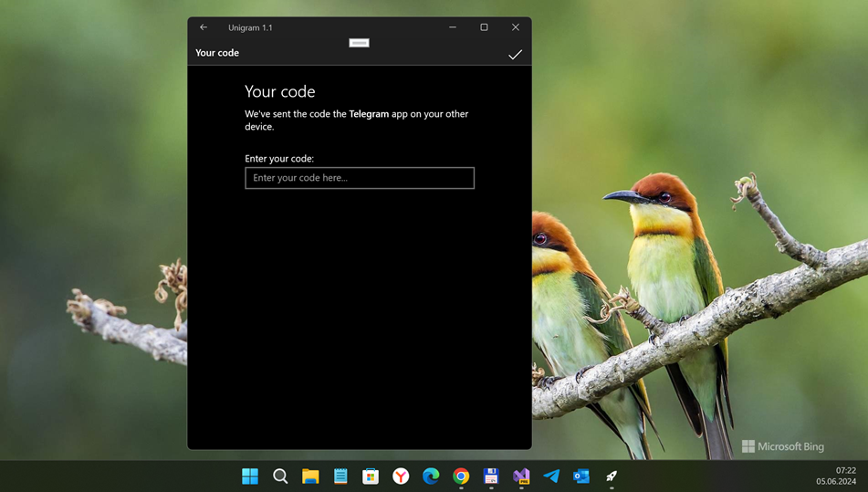

# UnigramMobile 1.1

# About
This is my own UnigramMobile "remake" (or RnD) for Windows 10 Mobile os. 

## Screenshot

   
## Features
- Based on more fresh [TDLib](https://github.com/tdlib/td) (Jan, 2024)
- Secret chats
- Instant view (now updated with the most recent 2.0)
- Multi-account
- Filter chats (users, bots, groups, channels, unread chats and unmuted chats)
- Calls
- Videos and photos editor (easily crop photos, set video resultion or remove some parts of the videos before sending them)
- Drag&drop files to chats to send them quickly
- Open chats in separated windows (Shift+click)
- Replace sent media content
- Polls 2.0
- Backgrounds 2.0 (blurred and motion options available)
- Built-in app lock with support for Windows Hello authentication (fingerprint, face and iris recognition)
- Advanced markdown editor for messages
- In-app music player
- Animated stickers and emojis
- Scheduled and silent messages
- Full support of Windows 10 notifications and Action Centre (reply to a message or mark it as read without opening the app)
- Accessibility for visually impaired people

## Tech. details
- C# & C++ codebase
- Win. os build 18362
- Min. Win. os bild 14393

## Main goal (point of my interest)
- Fix some/main API changes
- Background tasks
- (System) Timer(s)
- Notif. system (Push, etc.)

## Status
- More "fresh" TDLib assembled as VS Extension (not provided - DIY) and used for this project.
- Code refactoring started (main goal is to do all code compatible with changed tdlib!)
- Draft / Early bird / Not ready yet

## Known bugs
- No SMS when you entered your phone number (on attempt to auth).

## Wiki
For additional information (keyboard shortcuts, other contact information, FAQ, missing features, build instructions and other stuff) you can check [Unigram wiki](https://github.com/mediaexplorer74/UnigramMobile/wiki).

## References
- https://github.com/UnigramDev/Unigram/ Original Unigram (UWP) for Windows 11, XBox, etc.
- https://github.com/hihain/UnigramMobile/ Huhain's UnigramMobile "main fork"

## ..
As is. RnD only. For educational purposes. DIY.

## .
[m][e] 2024
